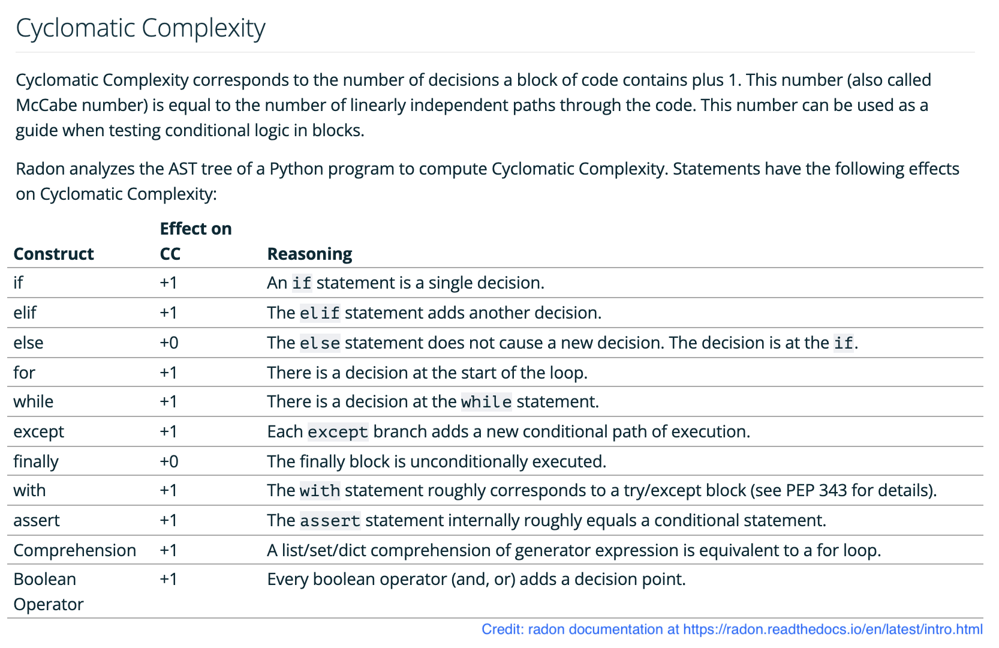

<!-- omit in toc -->
# Course Index - Taking Python to Production: A Professional Onboarding Guide

> ⚠️ Code examples including config files and CLI tools may go out of date because tools
> change often. Check the documentation for the tool you are using if you run into problems.
> You should really get into the habit of referring to offical docs anyway!

<!-- omit in toc -->
## Table of Contents

- [Unit 8 - Using automation to make continuous integration (the code review part) easier](#unit-8---using-automation-to-make-continuous-integration-the-code-review-part-easier)
  - [Pylint Part 3 - Configuring `pylint`](#pylint-part-3---configuring-pylint)
  - [Flake8](#flake8)
  - [Flake8 Plugin example: Darglint](#flake8-plugin-example-darglint)
  - [isort](#isort)
  - [Code Complexity: Radon, Xenon, McCabe](#code-complexity-radon-xenon-mccabe)
  - [Typing Part 1 - type hints, autocompletion, static vs dynamic type checking, and interpreted vs compiled](#typing-part-1---type-hints-autocompletion-static-vs-dynamic-type-checking-and-interpreted-vs-compiled)
  - [Typing Part 2 - mypy and basic typing](#typing-part-2---mypy-and-basic-typing)
  - [Typing Part 3 - Simple ("primitive" or "builtin") types and Complex ("generic") types](#typing-part-3---simple-primitive-or-builtin-types-and-complex-generic-types)
  - [Typing Part 4 - Union and Optional](#typing-part-4---union-and-optional)


## Unit 8 - Using automation to make continuous integration (the code review part) easier

### Pylint Part 3 - Configuring `pylint`

<!-- omit in toc -->
<!-- omit in toc -->
#### Notes

-  List of all Pylint rules **link**
-  "A foolish consistency is the hobgoblin of little minds." -PEP8 Every good rule has an exception. Follow linting rules in general, and take time to understand what they are trying to achieve. "Pragmatism is the rule." The beauty of Python is that you *can* "break rules" when you have a valid reason to.
- Ignore comments like `# pylint: disable=<some symbolic message or code>` statements, e.g. `pylint: disable=too-many-attributes` silences a single occurence of a Pylint error.
  - The fact that these go in your code makes it easy for code reviewers to see and therefore discuss why an exception was warranted. Additional comments *may* be desirable to preempt even those sorts of conversations.
  - Prefer using the human-readable "symbolic message" e.g. `too-many-attributes` over using the cryptic, error codes, e.g. `C0115` to save reviewers from having to look them up. 
  - Most linters support ignore comments, though the exact syntax varies

- You can disable rules for an entire project, too. Some pylint issues may not provide enough value to justify having developers spend time satisfying them.
  - Method 1: Pass arguments to `pylint`
    - `pylint --disable=too-many-attributes,missing-class-docstring <python files>` disable particular errors
    - `pylint --disable=C <python files>` disables all "convention violations" (error codes that start with `C`)
    - `pylint --enable=E <python files>` only enable errors
  - Method 2: A config file (`.pylintrc`)
    - You can generate a starter file with `pylint --generate-rcfile > .pylintrc`
    - `pylint` will pick up this config file is in the current working directory
    - Explicitly point `pylint` at a config file with `pylint --rcfile path/to/.pylintrc`
- Teams should have a standard config file for any linter they use, including `pylint` if they choose to use it.
- Avoid disabling too many rules. Try to use the defaults. This avoids "Holy War" arguments and encourages developers to learn best practices. Let tools be opinionated for you. But be pragmatic.
- There is no "magic" `pylint` ruleset. It's up for you or your team to decide. Start by enabling *every* `pylint` rule and taking the time to learn what they mean as they come up. You can incrementally remove rules if you or your team agree they are unreasonable. But you should always understand the *why* behind the rule before you do so. Books like *Clean Code* and *Refactoring* will go a long way toward that.

<!-- omit in toc -->
#### Assignments

<!-- omit in toc -->
##### Generate a `.pylintrc` file

1. Generate the file
2. Validate that `pylint` respects your file by disabling/enabling a specific rule
   and running it on some code you know has that violation

<!-- omit in toc -->
##### Configure VS Code for `pylint`

1. Install the `pylint` extension by Microsoft if you have not already done so.
2. Configure your `.vscode/settings.json`

```jsonc
{
    // ...
    "pylint.args": ["--rcfile=${workspaceFolder}/.pylintrc"],
}
```

<!-- omit in toc -->
##### Start creating your own `pylint` ruleset

Apply `pylint` to some code and refactor *every* violation.

This will be slow initially, but you will learn a lot. You will find that you remember the rules and in the future, you will naturally write code that does not have those violations.

### Flake8

<!-- omit in toc -->
#### Notes

- Pylint is not the only Python linter
- Pylint and Flake8 catch many of the same things, but each catch some the other does not so many projects and teams choose to run both
- Pylint supports plugins and there are *many*. Here is an open-source index of them **Link to awesome flake8 plugins**
- `pip install flake8`

Configuration options

Use the Flake8 support within the Python extension:

```jsonc
// .vscode/settings.json

{
    "python.linting.flake8Enabled": true
}
```

OR use the dedicated Flake8 extension. Installing the extension is enough to enable Flake8 hints in VS Code.

- Disable comments: 
  - `# noqa: E` ignore all errors
  - `# noqa: E305` ignore a specific error
  - Flake8 doesn't have a human-readable "symbolic message" like Pylint does! Very sad.
- The standard Flake8 config file name is `.flake8`
- `.flake8` uses the INI file format which has some major downsides over formats like TOML, YAML, JSON, etc. 
  - There are plugins, e.g. `Flake8-pyproject` that enable TOML support for `flake8`. Pylint supports TOML natively. A future section will explore configuring all of our code quality tools with TOML.

Example `.flake8` config file

```ini
# .flake8

[flake8]
extend-ignore =
    E305
```

- `flake8 --config path/to/.flake8 <python files>` directs Flake8 at this file

<!-- omit in toc -->
#### Assignments

<!-- omit in toc -->
##### Configure VS Code for Flake8

1. Install the `Flake8` extension by Microsoft if you have not already done so.
2. Configure your `.vscode/settings.json`

```jsonc
// .vscode/settings.json

{
    // ...
    "flake8.args": ["--config=${workspaceFolder}/.flake8"]
}
```

### Flake8 Plugin example: Darglint

<!-- omit in toc -->
#### Notes

- You can find lots of Flake8 plugins here **Link to awesome list**
- Installing plugins is easy. You just `pip install ...` the plugin and you are done!
- Flake8 Plugins may:
  - Add rules that Flake8 looks for. Since Flake8 integrates with VS Code, installing standalone tools as Flake8 plugins allows you to surface the rules of that tool in the VS Code `Problems` tab and get squiggly lines from that tool. For example,
    - `darglint` adds rules that make sure function arguments are documented in docstrings. `darglint` error codes start with `DAR`. It's common for tools to have a prefix for their rules.
    - `flake8-docstrings` is a wrapper around `pydocstrings` that adds rules that ensure docstrings
      follow a consistent format.
    - `flake8-spellcheck` adds spelling violation rules
  - Add command line arguments to `flake8` that are not available otherwise. For example, `Flake8-Pyproject` adds a `--toml-config` argument which allows you to point Flake8 at a file such as `pyproject.toml` or `flake8.toml`. TOML is superior to the INI format.
  - Add config options for the `.flake8` config file that would not otherwise do anything.
- Some tools, like one called `radon`, do not support `# noqa` statements, but since Flake8 does,
  if you install a tool as a Flake8 statement, you can take advantage of Flake8's `# noqa: <code>`
  comment engine to silence errors for that tool!

```ini
# .flake8

[flake8]
# config option only available when darglint is installed
docstring_style=google
```

<!-- omit in toc -->
#### Assignment

This is completely optional. If this assignment does not seem interesting, skip ahead.

1. Install `darglint` with `pip install darglint`. This automatically registers `darglint` as a Flake8 plugin.
2. Run `darglint` on some of your code and see if it catches any docstring errors.
3. Add an ignore statement for a `DAR` error in the `.flake8` config file to see that Flake8 respects Darglint's rules.

### isort

<!-- omit in toc -->
#### Notes

- `isort` is a standalone CLI tool for organizing imports
- the benefits of sorting imports include:
  - easier to find imports when there are many
  - easier to distinguish which types of imports are in a file (3rd party, 1st party, standard library, etc.)
  - reduces merge conflicts if imports are made to span multiple lines (`isort --fgw <python files>`)
- find the `isort` [config file reference here](https://pycqa.github.io/isort/docs/configuration/options.html#force-grid-wrap)
- `isort` is a code formatter, and so is `black`. `isort` might make some changes that `black` would undo. For example, if `isort` and `black` are configured with different line lengths, `isort` might put imports on multiple lines only to have `black` put them back. Manually specifying `--line-length` or `--profile=black` on `isort` to agree with black will fix this problem.

Example `.isort.cfg` file:

```ini
# .isort.cfg
[settings]
multi_line_output = VERTICAL_HANGING_INDENT
force_grid_wrap = 2
line_length = 99
profile = black
```

<!-- omit in toc -->
#### Assignments

<!-- omit in toc -->
##### Configure VS Code for isort

1. Install the `isort` extension by Microsoft if you have not already done so.
2. Write an `.isort.cfg` file
3. Configure your `.vscode/settings.json`

Example `.isort.cfg` file:

```jsonc
// .vscode/settings.json

{
    // ...
    "isort.args": ["--settings=${workspaceFolder}/.isort.cfg"],
    "[python]": {
        "editor.codeActionsOnSave": {
            "source.organizeImports": true
        },
        // enable black formatting
        "editor.formatOnSave": true,
        "editor.defaultFormatter": "ms-python.black-formatter",
    },
}
```

4. Validate that `isort` respects your file by running it on some code you know has that violation

### Code Complexity: Radon, Xenon, McCabe

<!-- omit in toc -->
#### Notes

- Clean code is secure, performant, and maintainable. Maintainable might be the most important. If code is easy to change, you can iterate to the others. *Readability* is key for code being easy to change. You should keep the complexity of your code low to help it be readable.
- Radon and McCabe have code complexity metrics like cyclomatic complexity, maintainability index, etc. 
  - [This page is a great reference](https://radon.readthedocs.io/en/latest/intro.html) for how Radon calculates these code complexity metrics.
  
- These metrics can be used to alert you if code is getting too complex.
- You can use these tools to set a complexity threshold.
- Metrics can be "gamed". Just because you bring code beneath Radon's threshold does not mean it is readable. Metrics are just a tool. As always, pragmatism is the rule. Use your judgement.
- Radon is a standalone CLI tool, but it is also a Flake8 plugin. To install it, just run `pip install radon` and it will auto-register with Flake8. Then you can use `# noqa: <radon error>` in exceptional cases to disable particular block of code that violates your complexity threshold.
- Usage:
  - `pip install radon`
  - `radon cc --show-complexity <python files>` calculates the cyclomatic complexity, specifically
  - `radon raw <python files>` 
- You can add radon configuration settings in the `.flake8` file:

```ini
# .flake8

[settings]
# vanilla flake8 settings
extend-ignore =
    E305
max-line-length = 99

# radon settings
radon-max-cc = 10
```

<!-- omit in toc -->
#### Assignments

<!-- omit in toc -->
##### Configure VS Code for Radon

1. Install radon with `pip install radon`
2. Write some code and measure its cyclomatic complexity
   - > Note: I have had the best luck with this when I write the logic **inside of functions** rather than writing the code in the global scope/namespace.
3. Install the Flake8 for VS Code if you have not already, and `pip install flake8 radon` in the same virtual environment, pointed at by VS Code.
4. Verify that you see red squiggly lines for functions that have high complexity
5. Write a `.flake8` file that configures Radon with a max complexity threshold
6. Validate your configuration file by writing code that gets a red squiggly line to appear when you go over your max CC threshold

### Typing Part 1 - type hints, autocompletion, static vs dynamic type checking, and interpreted vs compiled

<!-- omit in toc -->
#### Notes

- Python 3.5 introduced type hints to the language with syntax like 
  - `num: float = 10.0` or 
  - `def foo(a: int, b: str) -> bool:`
- Type hints enable your IDE to give you autocompletion (putting a `.` after a variable and seeing a list of methods/properties that are available on that variable)
- Popular libraries that were ported from Python 2 (or <3.5) struggled to apply type hints (Pandas, SQLAlchemy, Numpy, Flask, etc.).
  When Python 3.5 came out, many popular libraries were displaced by new libraries that used the statement "we have autocompletion all the way down" as a selling point. FastAPI and Typer are examples of this.
- There is research indicating that adding type information to your code prevents a large number of bugs from ever occuring.
- Lack of autocompletion in a codebase adds significant cognitive load for maintainers and customers.
  - Developers can work around this by "make round trips" to documentation sites as they reference the docs, but this slows down development.

<!-- omit in toc -->
#### Assignments

No assignments.

### Typing Part 2 - mypy and basic typing

<!-- omit in toc -->
#### Notes

- [PEP 484](https://peps.python.org/pep-0484/) is the design document that introduced type hints to Python
  - It assures Python developers that type annotations will never be mandatory, even by convention
  - Applying thorough type hints to your code usually requires you to
    structure your code in a way that is conducive to typing. This usually makes your code more readable. However,
    sometimes it forces you to complicate your code or prevents you from using "magic" that is not typeable.
    Developers should always have the option not to use type hints if there is a *compelling* reason not to.
- `mypy` is a static type checker for Python.
  - It is a CLI tool that you can run against code to find type violations. E.g. `num: float = "I'm not a float!"` would be a type violation.
  - There is also a VS Code extension for `mypy` that adds red squiggly lines for typing violations.
- `mypy` is considered Python's official "reference implementation" for a type checker:
  - Facebook wrote `wasabi`
  - Google wrote `pyre`
  - Microsoft wrote `pyright`, which is the type checker that powers VS Code's Python type checking in the Pylance (which is bundled with the official "Python" extension by Microsoft).

<!-- omit in toc -->
#### Assignments

1. Install `mypy` with `pip install mypy`, ideally in a virtual environment
2. Run `mypy` against some code that has type violations. For example, 

```python
# file.py

num: float = "I'm not a float!"`
```

3. Install the `mypy` extension for VS Code if you have not already
4. Validate your installation of of the VS Code extension by viewing a red squiggly line in the file from step (2).

### Typing Part 3 - Simple ("primitive" or "builtin") types and Complex ("generic") types

<!-- omit in toc -->
#### Notes

- This video covers [the first typing section of the mypy docs](https://mypy.readthedocs.io/en/stable/builtin_types.html)
  - The video is commentary on this page. If that does not sound valuable to you, you could read the documentation and skip ahead.
- We look at some basic types, i.e. `int`, `str`, `float`, `bytes`, `bool`, `Any`
- And some complex types, e.g. `Dict[str, int]`, `Dict[str, Set[int]]`
- "Broad" vs "Narrow" types, e.g.
  - `Iterable` vs `Set`, `List`, `Tuple`, etc.
  - `Sequence` vs `List`, `Tuple`
  - `Mapping` vs `Dict`
  - `Any` is the most broad type including all other types
- Make your type annotations as narrow as possible to get the best autocompletion
- Avoid using the `Any` type as much as you possible can
- `Type` is used like this:

```python
class Animal:
    ...

# the entire class is type-hinted like this
my_class: Type[Animal]  = Animal

# an instance of the class is type-hinted like this
squirrel: Animal = Animal()
```

<!-- omit in toc -->
#### Assignments

Read [this page](https://mypy.readthedocs.io/en/stable/builtin_types.html) of the mypy documentation.

### Typing Part 4 - Union and Optional

<!-- omit in toc -->
#### Notes

- "Type inference" is a process that static analyzers use to make guesses about which type a variable *should* be based on how it is used. Pylance does type inference. To see Pylance's guess at what type your variables are, hover over that variable with your cursor.
  - Type inference is not perfect. Hand-written type annotations are better.

```python
floats = 1.0, 2.0, 3.0,
```

Pylance's type inference for this is

```python
from typing import Literal, Tuple

floats: Tuple[Literal[1.0], Literal[2.0], Literal[3.0]]
```

But this is not a useful type annotation. It would likely be better to annotate it like this

```python
# assuming the tuple is of arbitrary length
floats: Tuple[float, ...]

# OR

# assuming the typle is of length 3
floats: Tuple[float, float, float]
```

- There is also a `Union` type. For example

```python
# pre-Python 3.10
from typing import List
values: List[Union[int, float, str]] = [1, 1.0, "hi", 2.0, "hello",]

# Python 3.10+
values: list[int | float | str] = [1, 1.0, "hi", 2.0, "hello",]
```

- I recommend avoiding the 3.10+ syntax since many Python environments (AWS Lambda, certain Docker images, certain Linux machines, etc.) do not support Python versions that high yet.
  - The newer language features make your code not backwards compatible with older versions of Python.
- `Optional` is a type that is used to indicate that a variable can be `None`. For example

```python
# pre-Python 3.10
from typing import Optional
maybe_num: Optional[int] = None
maybe_num = 1

# OR

from typing import Union
maybe_num: Union[int, None] = None
maybe_num = 1

# Python 3.10+
maybe_num: int | None = None
maybe_num = 1
```

<!-- omit in toc -->
#### Assignments

No assignments.
